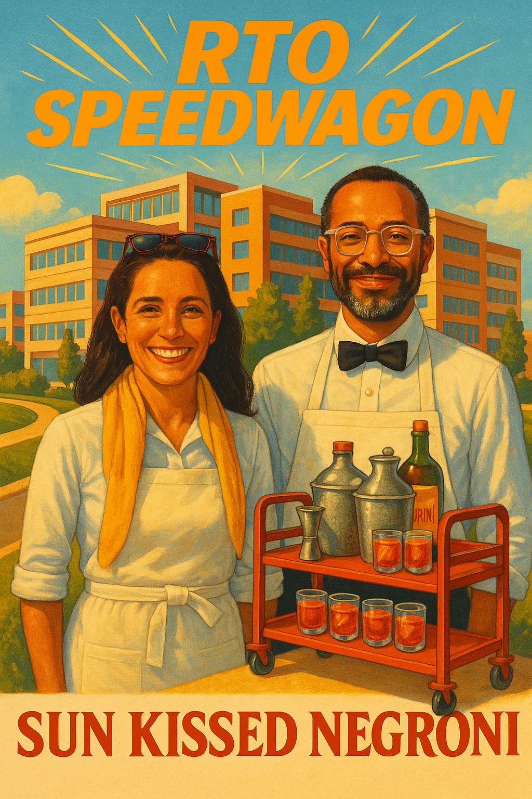

# RTO Speedwagon

## Sun Kissed Negroni

### Ingredients
- 1 oz Gin
- 1 oz Sweet Vermouth
- 1 oz Campari
- 1 oz Fresh Orange Juice
- Orange Peel or sliced dried mango with chili pepper for garnish

### Instructions
1. Fill a Boston Shaker with ice.
2. Add gin, sweet vermouth, Campari, and fresh orange juice.
3. Shake well until chilled.
4. Strain into a chilled rocks glass filled with ice.
5. Garnish with an orange peel or a slice of dried mango sprinkled with chili pepper.

### Playlist
<iframe style="border-radius:12px" src="https://open.spotify.com/embed/playlist/5hzPsJEGt5ZRjSeMtiNL66?utm_source=generator" width="100%" height="352" frameBorder="0" allowfullscreen="" allow="autoplay; clipboard-write; encrypted-media; fullscreen; picture-in-picture" loading="lazy"></iframe>